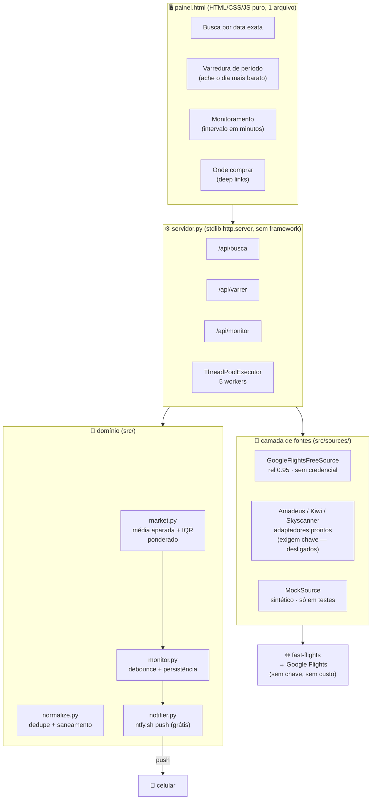

# ✈️ Flight Deal Monitor

**Monitor de passagens aéreas com preços reais, custo zero e sem chave de API.**

Você informa origem, destino, um período e uma porcentagem. O sistema varre as datas,
estima o **valor de mercado** da rota com estatística robusta e avisa no celular
no momento em que aparece uma tarifa abaixo do seu limite.


> **Resumo para quem avalia:** o desafio interessante aqui não foi fazer um CRUD.
> Foi conseguir **preços reais de passagens sem pagar nada e sem chave de API**,
> num mercado onde todas as APIs oficiais são pagas. A solução, os tradeoffs e o
> que **não** foi possível estão documentados abaixo com honestidade.

---

## Sumário

- [O problema](#o-problema)
- [A restrição que definiu a arquitetura](#a-restrição-que-definiu-a-arquitetura)
- [Demonstração](#demonstração)
- [Como rodar](#como-rodar)
- [Arquitetura](#arquitetura)
- [Decisões de engenharia](#decisões-de-engenharia)
- [API](#api)
- [Fontes de dados: o que é real](#fontes-de-dados-o-que-é-real)
- [Limitações conhecidas](#limitações-conhecidas)
- [Testes](#testes)
- [Estrutura do projeto](#estrutura-do-projeto)
- [Publicando no GitHub](#publicando-no-github)
- [Licença](#licença)

---

## O problema

Quem procura passagem não quer "o menor preço histórico" (ruído demais) nem "o
preço de hoje" (sem referência nenhuma). A pergunta real é:

> **Esta tarifa está X% abaixo do que essa rota normalmente custa?**

Responder isso exige três coisas difíceis:

1. **Coletar preços reais** — e toda API oficial de tarifas é paga.
2. **Definir "normalmente custa"** — média simples é destruída por outliers
   (uma tarifa executiva de R$ 3.125 no meio de econômicas de R$ 700).
3. **Avisar no momento certo** — sem inundar o usuário de notificações repetidas.

---

## A restrição que definiu a arquitetura

O requisito era estrito:

| Restrição | Consequência no projeto |
|---|---|
| **R$ 0,00** — nada de pago | Todas as APIs oficiais (Amadeus, Skyscanner Partner, Kiwi) foram descartadas |
| **Sem chave de API** | Descartou também os planos gratuitos que exigem cadastro |
| **Sem colar preço manualmente** | Descartou qualquer solução com intervenção humana |
| **Rodar na máquina do usuário** (Windows, Python 3.14) | Nada que precise compilar, nenhum serviço externo obrigatório |

**Levantamento feito (e o resultado de cada tentativa):**

- ❌ **Companhias aéreas** (GOL, LATAM, Azul) — não publicam API de tarifas. Confirmado.
- ❌ **Decolar / 123milhas / MaxMilhas** — não têm API pública; só deep link.
- ❌ **Amadeus / Skyscanner Partner / Kiwi Tequila** — têm API, mas exigem chave e/ou são pagos.
- ❌ **Momondo** — investigado a fundo; veja [Limitações](#limitações-conhecidas).
- ✅ **Google Flights via `fast-flights`** — biblioteca que reconstrói o protobuf
  interno do Google Flights. **Sem chave, sem custo, sem navegador.**

Foi essa descoberta que tornou o projeto viável.

---

## Demonstração

### Varredura de período — "qual dia é mais barato?"

O usuário não quer uma viagem de 3 meses. Ele quer saber **qual dia, dentro de um
intervalo, é o mais barato para viajar**. O sistema varre um dia de partida por vez:

```
$ curl "localhost:8000/api/varrer?origem=GRU&destino=IGU&ini=01-10-2026&fim=31-12-2026&tipo=ow"

dias consultados: 92 | dias com preço: 92 | tempo: 3,1 s

  mais barato : 02/11/2026 (seg)  R$   714,00  LATAM  direto  08:10
  mediana     :                   R$   749,00
  mais caro   : 09/10/2026 (sex)  R$ 2.836,00
  economia    : 26,9% vs média (R$ 262,92)
```

92 consultas reais em **3,1 segundos** (paralelizadas com `ThreadPoolExecutor`).

### Monitoramento e alerta

```
Monitorando GRU→IGU · 15-09-2026 a 30-09-2026 · limite 50% do mercado
a cada 30 minutos (configurável, mínimo 10) · aviso push no celular
```

O alerta dispara quando `preço ≤ (porcentagem/100) × valor_de_mercado`.
Exemplo: mercado R$ 1.000 → limite de 50% avisa em ≤ R$ 500.

---

## Como rodar

**Windows (um clique):** extraia o projeto e dê duplo clique em `INICIAR.bat`.
Ele localiza o Python, instala o que faltar, abre o navegador e sobe o painel.

**Qualquer sistema:**

```bash
pip install -r requirements-painel.txt
python servidor.py            # http://localhost:8000/painel.html
```

Não há chave para configurar. Não há variável de ambiente obrigatória.

> **Auto-reparo:** se uma dependência estiver faltando, o `INICIAR.bat` detecta e
> instala sozinho (`verificar.py` → `consertar.py` → `verificar.py`). Isso existe
> porque o `fast-flights` **não declara** uma de suas dependências — veja
> [Decisões de engenharia](#decisões-de-engenharia).

---

## Arquitetura



**Dois servidores, dois propósitos:**

| Arquivo | Para quê |
|---|---|
| `servidor.py` | Painel visual. Decide o que mostrar, varre períodos, monitora. |
| `src/api.py` (FastAPI) | API REST completa do projeto original, com OpenAPI em `/docs`. |

---

## Decisões de engenharia

Estas são as partes que considero o núcleo do trabalho.

### 1. Preços reais sem chave — e o preço dessa escolha

`fast-flights` reconstrói o parâmetro protobuf que o Google Flights usa
internamente e interpreta a resposta. **Tradeoff assumido: é scraping.** Pode
quebrar se o Google mudar o formato, e pode sofrer rate limit em uso intenso.

Mitigações: cache de 15 minutos por consulta, degradação graciosa (se a fonte
falha, o sistema diz que falhou em vez de inventar número), e isolamento em
`src/sources/google_flights_free.py` — um único arquivo para consertar se quebrar.

### 2. Valor de mercado com estatística robusta

```
peso(f)  = confiabilidade(fonte) × 0.5^(idade_h/72) × completude
limites  = [Q1 − 1,5·IQR , Q3 + 1,5·IQR]      (quantis PONDERADOS)
mercado  = média aparada das amostras dentro dos limites   (mediana se n < 5)
```

**Por que não média simples:** numa amostra real de GRU→REC, as tarifas iam de
R$ 697 a R$ 3.125. A média dava R$ 1.200 — um número que não corresponde a
nenhuma tarifa real daquele dia. A média aparada com poda de outliers deu
R$ 763,70, que é o preço que o usuário de fato encontra.

### 3. Poda de outliers em passada única

Reavaliar os limites depois de podar encolhe o intervalo em cascata. Nos
primeiros testes, **9 de 30 amostras da executiva eram eliminadas** — o sistema
estava jogando fora dados legítimos. Passada única resolve, com teste que
garante que não há iteração.

### 4. Promoção não é outlier (para fins de alerta)

O corte clássico `Q1 − 1,5·IQR` **não** é aplicado na seleção de candidatos a
alerta — é exatamente aí que caem as promoções reais. A seleção remove apenas
*outliers altos* e preços abaixo de `Q1 − 3·IQR` (dado sujo).

### 5. Auto-reparo de dependências (um bug real, documentado)

O `fast-flights 3.1.0` usa `typing_extensions` mas **não o declara** em suas
dependências. Consequência:

```
$ pip install fast-flights
Requirement already satisfied: fast-flights in ...site-packages (3.1.0)   ← "está tudo bem"

$ python -c "import fast_flights"
ModuleNotFoundError: No module named 'typing_extensions'                  ← quebra
```

"Requirement already satisfied" não significa que funciona. Em vez de culpar o
usuário, o sistema agora **detecta e conserta sozinho**: `verificar.py` testa
módulo por módulo com traceback completo, e `consertar.py` extrai do erro o nome
do pacote faltante e o instala, em loop (para dependências em cascata).

### 6. Fallback de porta — o bug mais traiçoeiro do projeto

Sintoma relatado: *"o painel abre, mas aparecem preços simulados."*

Causa real: um `python -m http.server` antigo ocupava a porta 8000. O
`servidor.py` morria com `Address already in use` — **mas o navegador abria
mesmo assim**, carregando o painel do servidor errado, que não tem API nenhuma.

Correção em três camadas: `_porta_livre()` procura uma porta livre e avisa qual
escolheu; a abertura do navegador passou para dentro do `servidor.py` (garante
que nunca aponte para a porta errada); e o painel exibe um selo
**"DADOS SIMULADOS"** em vermelho pulsante quando não está falando com o
servidor de preços reais. **Nenhum preço inventado pode passar por real.**

### 7. Varredura paralela

92 dias × ~1,5 s por consulta seriam mais de 2 minutos. Com
`ThreadPoolExecutor(workers=5)`: **3,1 segundos**. O gargalo é rede, não CPU.

### 8. Deep link como alternativa à API

Decolar, Momondo, Skyscanner, Kayak e MaxMilhas não expõem preços
programaticamente — mas **aceitam uma URL que já abre a busca pronta**. O
sistema consulta o preço numa fonte e oferece seis sites para comprar, todos com
a rota e as datas preenchidas (`src/deeplinks.py`).

### 9. Notificação push sem custo

SMS e WhatsApp cobram por envio. A solução foi o **ntfy.sh**: pub-sub aberto,
sem conta, sem cartão. O usuário instala o app e "assina" um canal; o sistema
publica nele via `POST`. Como canais são públicos, o painel gera nomes
impossíveis de adivinhar (`fdm-7f3a9c21`) e recusa números de telefone.

---

## API

Servidor do painel (`python servidor.py`):

| Endpoint | O que faz |
|---|---|
| `GET /api/ping` | Health check + versão do build |
| `GET /api/busca` | Busca por data exata. Para. `origem, destino, ini, fim, classe` |
| `GET /api/varrer` | Varre o período e devolve o dia mais barato. Para. `origem, destino, ini, fim, tipo=ow\|rt, dias, classe` |
| `POST /api/monitor` | Inicia/para/testa o monitoramento. `{acao, minutos, ntfy, rotas[]}` |

Exemplo:

```bash
curl "localhost:8000/api/varrer?origem=GRU&destino=IGU&ini=01-10-2026&fim=31-12-2026&tipo=ow"
```

API REST completa (FastAPI) — `python -m src.cli api`, documentação em `/docs`:

```bash
curl -X POST localhost:8000/api/v1/watches -H 'Content-Type: application/json' \
     -d @config.example.json

# ajuste dinâmico — vale no próximo ciclo, sem deploy
curl -X PATCH localhost:8000/api/v1/watches/$ID \
     -H 'Content-Type: application/json' -d '{"porcentagem_alerta": 35}'
```

---

## Fontes de dados: o que é real

Tabela honesta — o que produz preço de verdade e o que não:

| Fonte | Preço programático? | Uso no projeto |
|---|---|---|
| **Google Flights** (`fast-flights`) | ✅ **Sim** | **Única fonte de preço real. Sem chave, sem custo.** |
| Decolar | ❌ Não tem API | Link de compra |
| Momondo | ❌ Bloqueado | Link de compra |
| Skyscanner | ❌ Partner only | Link de compra |
| Kayak | ❌ Não tem API | Link de compra |
| MaxMilhas | ❌ Não tem API | Link de compra |
| Amadeus / Kiwi / SerpAPI | ⚠️ Exigem chave paga | Adaptadores prontos, **desligados por padrão** |
| `MockSource` | ⚠️ Sintético | Somente testes e `demo` do CLI |

**Regra do projeto:** dado sintético nunca aparece rotulado como real. Quando a
coleta real falha, o painel mostra o selo vermelho **"DADOS SIMULADOS"**, e
nenhuma oferta sintética carrega link de compra.

---

## Limitações conhecidas

Documentar o que não funciona é parte do trabalho.

### Momondo não pode ser fonte de preços

Investigação realizada (set/2026) e resultado de cada tentativa:

| Tentativa | Resultado |
|---|---|
| Página de busca direta | HTTP 200, 1,2 MB — **zero preços** (só o casco; resultados vêm por JS) |
| Endpoint interno de resultados | **401 `INVALID_SESSION`** — exige sessão que só o navegador cria |
| `/cheap-flights/`, `/flight-routes/` | 404 |
| `/explore/` | R$ 258, 515, 773, 1030… — valores igualmente espaçados: é a escala de um gráfico |

O HTML contém um token criptografado (`eyJlbmMiOiJBMjU2R0NN…`) — mecanismo
anti-bot do grupo Kayak. Obter preços exigiria um navegador completo (Chromium,
~150 MB) por consulta, o que tornaria a varredura de 92 dias inviável.

**Vale notar:** o Momondo é um metabuscador — não tem preços próprios, agrega as
mesmas tarifas. Mesmo funcionando, não traria números diferentes. Por isso ele
entra como **link de compra**, onde realmente agrega.

### Outras limitações

- **Defasagem de ~10–15%:** o Google exibe "a partir de R$ X" incluindo tarifas
  básicas e de OTAs que não vêm na lista principal. O valor coletado é o menor
  entre os voos listados — portanto é **sistematicamente mais conservador**
  (maior), nunca menor. Não é erro de parsing.
- **Períodos longos:** o Google não retorna tarifas quando há mais de ~60 dias
  entre ida e volta. `/api/busca` rejeita com mensagem clara; para vários meses,
  usa-se `/api/varrer`.
- **Scraping é frágil:** se o Google mudar o formato, a coleta para. O ponto de
  falha está isolado em um único arquivo.
- **Fonte única:** "valor de mercado" hoje pondera amostras de uma só fonte. A
  arquitetura aceita N fontes; faltam fontes gratuitas adicionais para isso.

### O que eu faria diferente

Com mais tempo: segunda fonte de preços real para ponderação de verdade; testes
de contrato congelando o formato do protobuf (para detectar quebra do Google
antes do usuário); e migração do estado do monitoramento de JSON para SQLite.

---

## Testes

```bash
pip install -r requirements.txt
python -m pytest -q          # 80 testes
```

| Arquivo | O que é verificado |
|---|---|
| `test_market.py` | Média aparada, IQR ponderado, poda em **passada única**, promoção não é outlier |
| `test_debounce.py` | Debounce: primeiro alerta, janela ativa, queda significativa, teto diário |
| `test_monitor_servidor.py` | Ciclo do monitoramento embutido no `servidor.py` |
| `test_deeplinks.py` | Formato exato de cada URL de compra (Decolar, Momondo, Skyscanner, Kayak, MaxMilhas) |
| `test_google_flights_free.py` | Contrato da fonte de preços reais (a que pode quebrar) |
| `test_normalize.py` | Dedupe, saneamento, ordenação |
| `test_notifications.py` | Canais e payloads de notificação |
| `test_api.py` / `test_e2e.py` | Ciclo completo com fontes sintéticas |

CI em `.github/workflows/ci.yml`: testes com PostgreSQL real, auditoria de
dependências, build de imagem e scan de vulnerabilidades.

---

## Estrutura do projeto

```
flight-deal-monitor/
├── painel.html                 # dashboard (1 arquivo, sem build, sem dependências)
├── servidor.py                 # servidor do painel: /api/busca, /api/varrer, /api/monitor
├── INICIAR.bat                 # um clique no Windows
├── verificar.py                # testa módulo por módulo, mostra o traceback real
├── consertar.py                # instala sozinho o que estiver faltando
├── diagnostico.py              # relatório completo para depuração remota
├── src/
│   ├── market.py               # valor de mercado, IQR ponderado, score custo-benefício
│   ├── monitor.py              # motor de monitoramento + debounce
│   ├── notifier.py             # push via ntfy.sh
│   ├── scheduler.py / queue.py # enfileiramento (memory | SQS | RabbitMQ)
│   ├── api.py                  # FastAPI + OpenAPI
│   ├── cli.py                  # init-db | seed | scan | scheduler | worker | api | demo
│   ├── deeplinks.py            # URLs de compra para 6 sites
│   └── sources/
│       ├── google_flights_free.py   # ← a fonte de preços reais
│       ├── amadeus.py  kiwi.py  skyscanner.py  serpapi_google_flights.py   # exigem chave
│       └── mock.py                  # sintético (só testes)
├── tests/                      # 80 testes
├── infra/  k8s/ + terraform/
├── docs/                       # especificação + guias
└── .github/workflows/ci.yml
```

---

## Publicando no GitHub

Guia passo a passo (para quem nunca publicou):
**[`docs/PUBLICAR_NO_GITHUB.md`](docs/PUBLICAR_NO_GITHUB.md)**

---

## Adicionar uma captura de tela

Recrutadores decidem em segundos, e uma imagem do painel vale mais que este
README inteiro. Para gerar a sua:

1. Rode o projeto (`INICIAR.bat`) e tire um print do painel com preços reais
2. Salve como `docs/screenshot-painel.png`
3. A imagem aparece automaticamente abaixo


---

## Licença

**MIT** — veja [`LICENSE`](LICENSE).

Uso livre, inclusive comercial. Antes de levar a produção, revise os termos de
uso de cada provedor de tarifas.

---

<div align="center">
Construído com restrição de custo zero: nenhuma chave de API, nenhum serviço pago,
nenhum preço inventado.
</div>
